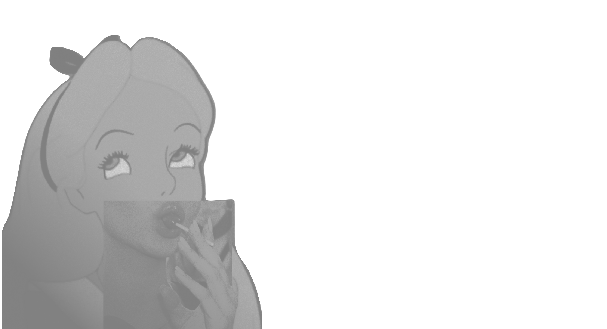
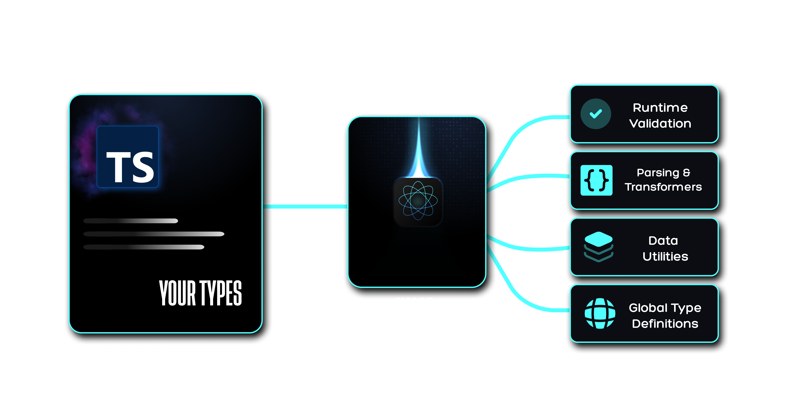

<p align="center">
  
</p>

<div align="center">

  <a href="https://www.npmjs.com/package/@bgskinner2/xalor">
    
  </a>

  <a href="https://www.npmjs.com/package/@bgskinner2/xalor">
    
  </a>

  <a href="https://github.com/YOUR_REPO/blob/main/LICENSE">
    
  </a>

  <a href="https://bundlephobia.com/package/@bgskinner2/xalor">
    
  </a>

</div>

&nbsp;

<p align="center">
    📦  <a href="https://github.com/bgskinner3/axiom-kit/blob/main/packages/xalor/docs/Installation.md">Installation</a>
  •
  📖 <a href="https://github.com/bgskinner3/axiom-kit/blob/main/packages/xalor/docs/api.md">Docs</a>
  •
  ⚙️ <a href="https://github.com/bgskinner3/axiom-kit/blob/main/packages/xalor/docs/api.md">API Ref</a>
</p>

---

&nbsp;

<div align="center">

<p style="font-size:20px; max-width:700px;">
“A build-time TypeScript engine that turns your native types into a live runtime validation and generation system — without duplicating schemas or shipping validation libraries.”
</p>

</div>

&nbsp;

## 💥 The Runtime Gap

TypeScript ends at compile time. Your application does not.

At runtime, type safety is rebuilt manually across the stack:

- APIs trust external data by default
- Validation is re-implemented in schemas, guards, and DTOs
- Libraries like Zod/io-ts duplicate TypeScript models at runtime
- Type drift emerges between compile-time and execution
- Every boundary re-expresses the same rules in a different form

**Result:** type safety becomes duplicated intent, not enforced structure.

At runtime, TypeScript is no longer a constraint — it is just documentation.

&nbsp;

<p align="center">
  
</p>

&nbsp;

## ⚡ The Inversion

Xalor removes the boundary between compile-time and runtime by compiling TypeScript types into persistent runtime metadata.

Your types are no longer erased after build — they become a live structural registry that powers runtime behavior.

Instead of defining schemas alongside types (Zod, io-ts, custom guards), Xalor treats TypeScript as the single source of truth and compiles it directly into a runtime type system.

That means:

❌ No schema duplication  
❌ No type drift between compile-time and runtime  
❌ No validation libraries shipped in your bundle  
❌ No re-declared models across layers

Just native TypeScript types → compiled into a live runtime system.

Write types once.  
Everything else is derived.

---

&nbsp;

<p align="center">
  
</p>

&nbsp;


## ⚖️ Xalor vs Schema-Based Runtime Systems

| Capability                              |          Xalor          |     Zod / Ajv      |
| --------------------------------------- | :---------------------: | :----------------: |
| Persistent type graph                   |           ✔️            |         ❌         |
| IDE ↔ runtime shared registry           |           ✔️            |         ❌         |
| Source-code traceability (GPS errors)   |           ✔️            |         ❌         |
| Multi-layer type storage (Vault system) |           ✔️            |         ❌         |
| Build-time type compilation             |           ✔️            |         ❌         |
| Single source of truth (TS-only)        |           ✔️            |         ❌         |
| Runtime model                           | Precompiled type system | Runtime validation |
| Schema duplication required             |           ❌            |         ✔️         |

&nbsp;

&nbsp;

## 📦 Install

```bash

npm install @bgskinner2/xalor
npm install --save-dev ts-patch typescript

```

---

## ⚡ Quick Start

Xalor works by compiling your native TypeScript types into a persistent runtime type system during your normal build process.

No runtime setup required — just install, configure once, and use native TypeScript.

👉 Full setup & configuration guide: [Installation & Config Docs](https://github.com/bgskinner3/axiom-kit/blob/main/packages/xalor/docs/Installation.md)

---

&nbsp;

&nbsp;


## 🧪 API Peek

### `registerXalor<"KEY", Type>()` (The Registor)

A single gateway for registering types into the global Xalor registry.  
Supports multiple overload patterns through a unified API surface.


###  🧬 Type Injection 

```ts
type TUser = {
  id: number;
  name: string;
  address: {
    street: string;
    city: string;
  };
};

/**
 * Associates a compile-time TypeScript type with a global registry key.
 *
 * In development mode, saving the file (or triggering a build) will
 * automatically register this type into the runtime registry.
 *
 * With IDE integration enabled, registration happens immediately on save.
 */

registerXalor<'USER_KEY', TUser>();
```
### 📦 Object Inference (flexible API)

Or Just pass Your Whole Data Object

```ts
const userData = {
  id: 1,
  name: 'Alex Carter',
  address: {
    street: '42 West Market St',
    city: 'New York',
  },
};

/**
 * The API is not limited to declared TypeScript types.
 *
 * You can also register runtime data objects directly, using the
 * provided key as the registry identifier.
 *
 * This allows rapid prototyping without explicit type declarations.
 */
registerXalor<'USER_TEST_4'>(userData);

```

Either way you register to the vault your type its pormised to be gloablly acessible and aviablbe to any other of our runtime APis

---

&nbsp;

### `validateXalor` (The Validator)

A multi-mode runtime type gateway for checking, asserting, and parsing data from your compiled TypeScript registry.


### 🛡️ Guard (type-safe predicate)

```ts
/**
 * Creates a runtime type guard derived from the registered "USER" type.
 *
 * Once a type is registered, it becomes globally available across all APIs
 * via the shared runtime type registry.
 *
 * This removes the need for manually writing and maintaining separate
 * validation or guard functions.
 */
const isUser = validateXalor<'USER', 'guard'>();

if (isUser(data)) {
  // fully typed as User
}

```

### ⚡ Parse (safe transformation)


```ts

/**
 * Parses unknown input into a strongly typed "USER" object.
 *
 * If validation fails, the runtime safely handles the failure path
 * using the internal registry rules.
 */
const parseUser = validateXalor<'USER', 'parse'>();

const user = parseUser(data);

// Example of internal failure handling (conceptual):
// return fallbackValue;

```

All APIs are powered by a single compiled TypeScript registry, enabling shared access across validation, parsing, and generation layers without duplicated schemas or external validation systems.

👉 Full API reference: [Full API](https://github.com/bgskinner3/axiom-kit/blob/main/packages/xalor/docs/api.md)

---

&nbsp;

&nbsp;

## ✨ Core Features

- ✔ **Native TypeScript → runtime system**  
  Your types become executable at build-time

- ✔ **Persistent structural type graph (Vault system)**  
  Types are stored, reused, and never redefined

- ✔ **Shared IDE + runtime registry**  
  One registry powering both autocomplete and execution

- ✔ **Zero schema duplication**  
  No Zod-style mirrored definitions

- ✔ **Global type store access**  
  Types are accessible anywhere in the runtime layer

- ✔ **Tree-shakeable by design**  
  Only what you use is included in the bundle

- ✔ **Build-time compilation (no runtime overhead)**  
  Everything is generated during build, not execution

👉 **Full feature set:** [All Features](https://github.com/bgskinner3/axiom-kit/blob/main/packages/xalor/docs/features.md)


---

## 📄 License

This project is licensed under the MIT License.

© 2024 Brennan Skinner
