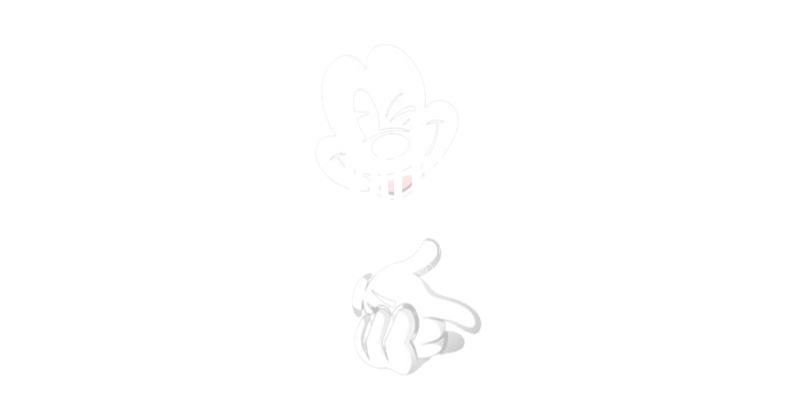

<p align="center">
  
</p>

<div align="center">

  <a href="https://www.npmjs.com/package/@bgskinner2/xalor">
    
  </a>

  <a href="https://www.npmjs.com/package/@bgskinner2/xalor">
    
  </a>

  <a href="https://github.com/YOUR_REPO/blob/main/LICENSE">
    
  </a>

  <a href="https://bundlephobia.com/package/@bgskinner2/xalor">
    
  </a>

</div>

&nbsp;

<p align="center">
    📦  <a href="./docs/installation">Installation</a>
  •
  📖 <a href="./docs">Docs</a>
  •
  ⚙️ <a href="./docs">API Ref</a>
</p>

---

&nbsp;

<div align="center">

<p style="font-size:20px; max-width:700px;">
“A build-time TypeScript engine that turns your native types into a live runtime validation and generation system — without duplicating schemas or shipping validation libraries.”
</p>

</div>

&nbsp;


## The Runtime Gap

TypeScript gives you powerful types — but they disappear at runtime.

That creates a hidden gap in modern applications:

- Your API receives untrusted data with no built-in guarantee it matches your types
- Validation is duplicated across schemas (Zod, io-ts, custom logic)
- Types and runtime logic drift over time
- Every layer of the system re-defines the same structure in different ways

The result is a fragmented system where TypeScript is “true at compile-time” — but optional at runtime.

&nbsp;


<div align="center">
  <div style="max-width: 600px; text-align: center;">
Most validation libraries require you to redefine your types as schemas at runtime.
<br/>

**We invert this model:**

<br/>

Your TypeScript types are the source of truth — everything else is generated from them at build-time.

  </div>
</div>

&nbsp;

## The Inversion

Xalor closes the gap between compile-time and runtime by turning TypeScript types into persistent, executable metadata.

Instead of duplicating schemas or rebuilding validation logic, Xalor:

- Compiles native TypeScript types during build time
- Stores them in a lightweight runtime vault
- Uses a global registry to access them anywhere in the app
- Generates validation, parsing, and data utilities from the same source of truth

This means your types don’t just describe your system — they _become the system at runtime_.

Write types once. Use them everywhere. Ship no duplicate validation layer.

---

## Install

---

## ⚡ Quick Start


View the full installation and configration process 
> LINK


---

## 🧪 API Peek

### `registerXalor` (The Registor)

One gateway multiple ways to register types. Our Dyanmic overloaded methods wrap multiple ways to register types.

By stright Type injection

```ts

```


Or Just pass Your Whole Data Object

```ts

```

Either way you register to the vault your type its pormised to be gloablly acessible and aviablbe to any other of our runtime APis

### `validateXalor` (The Validator)

The Swiss-Army knife of validation. Use it to check, assert, or parse data.

```ts

```

All packed into one avaiible function and more!

See all live apis and avioable and pending functionalities
> LINK


---

## Features

- list 3-4 current features ... examples ?


View All
> LINK

---

---

Examples
Philosophy
Deep Dive (Medium)
LIcense